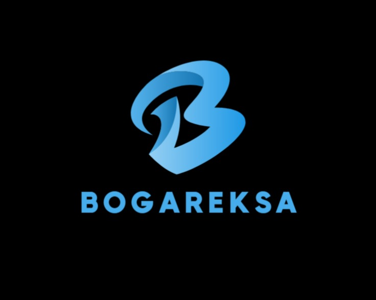

<!-- Project Title -->
<h1 align="center">BOGAREKSA</h1>

<!-- Project Logo -->

  

<!-- Description about the Project -->

  Indonesia confronts a pressing dilemma as one of the world's top food waste generators, discarding 20.94 million metric tons of food from households in 2020, equivalent to 37% of its total food production. Simultaneously, the nation grapples with severe food security issues, with approximately 7.9% of the population (nearly 20.3 million people) enduring malnourishment, accompanied by high rates of stunting (29.6%) and wasting (9.5%). To address these intertwined challenges, our project envisions a solution that connects surplus food from restaurants and supermarkets to low-income communities. This initiative aims to curb the volume of food destined for landfills while expanding access to nutritious and affordable food for those affected by food insecurity.

<!-- Divider -->

<!-- About the Team Section -->
<h2>Capstone Team</h2>

<!-- Team Members Table -->
<table>
  <tr>
    <th>No.</th>
    <th>Learning Path</th>
    <th>Bangkit ID</th>
    <th>Name</th>
    <th>University</th>
  </tr>

  <!-- Row for the first member -->
  <tr>
    <td>1</td>
    <td>ML</td>
    <td>M227BSY1145 </td>
    <td>Leonardus Virmus Danar Kusuma Putra</td>
    <td>Universitas Jember</td>
  </tr>
  
  <!-- Row for the second member -->
  <tr>
    <td>2</td>
    <td>ML</td>
    <td>M012BSY0534 </td>
    <td>Tegar Fadillah Zanestri</td>
    <td>Universitas Telkom</td>
  </tr>
  
  <!-- Row for the third member -->
  <tr>
    <td>3</td>
    <td>ML</td>
    <td>M183BSY1342</td>
    <td>I Putu Artoya</td>
    <td>Universitas Amikom Yogyakarta</td>
  </tr>

  <!-- Row for the fourth member -->
  <tr>
    <td>4</td>
    <td>CC</td>
    <td>C227BSY3819</td>
    <td>Rahadyan Rizqy Addhoyfurrakhman</td>
    <td>Universitas Jember</td>
  </tr>

  <!-- Row for the fifth member -->
  <tr>
    <td>5</td>
    <td>CC</td>
    <td>C692BSX3863</td>
    <td> Intan Andini</td>
    <td>Universitas Muhammadiyah Metro</td>
  </tr>

  <!-- Row for the sixth member -->
  <tr>
    <td>6</td>
    <td>MD</td>
    <td>A227BSY2454</td>
    <td>Reihan Wudd Hibatullah</td>
    <td>Universitas Jember</td>
  </tr>

  <!-- Row for the seventh member -->
  <tr>
    <td>7</td>
    <td>MD</td>
    <td>A128BSY2592</td>
    <td>Rifaldlee</td>
    <td>Politeknik Negeri Jakarta</td>
  </tr>
</table>

<!-- Divider -->

  
